# Since 2025 September 1sh
- test
- 

- [draft](draft) <-- *always* put this at first line for quick idea capturing and organizing
- [portal](portal)
- [resources](resources)

# mynote

1. [program](program)
2. [package](package)
3. [uni](uni)

- think of how to got the data for now
- mimosatek: office in Thu Duc
- farmers in soctrang:
  - gated and ungated
  - 
  - Consider adding a short household survey (even 20–30 questions on smartphone ownership, cooperative membership, plot gating status, income) alongside your 15–30 qualitative interviews, since it would let you contextualize your qualitative sample against broader village-level patterns without much added time cost.
  - understand a little bit about the time of season/ salinity season/ time of sowing,... everything that related to rice farming season
  - 
  - 
- 


- https://garc.ntu.edu.tw/%e7%8d%8e%e5%8a%a9%e9%87%91/%e8%be%a6%e6%b3%95/ NTU Social science scholarship


- different objects layers, then climate service how are they play a role in this cross level
- thoi tiet


- 
- https://us.humankinetics.com/blogs/excerpt/major-movements
  - Major Movements
  - Although thousands of movements occur in a single tennis match, a certain number of movements are common to the sport of tennis. Becoming proficient in these major movements will help you become a better mover on the tennis court and therefore a better overall player. Training for tennis requires that you repeat good quality movement patterns on a regular basis. Having a clear understanding of the correct movement patterns and how best to train to improve them will speed your improvement and make you more efficient on the court. Over time it can also reduce the chance of injury resulting from inefficient movements, poor loading patterns, and overuse as a result of inappropriate mechanics.


- use AI to generate schematic AI figure, each  video file one figure
  - everything next friday
  - FIGURE => represent the content
  - represent the main concepts so the reader catch the main idea of the video
  - rearrange the excel later so look into the 5th video we just need to get the 10 second to 20 seconds
  - arrange video file


- A_0010D052H260410_訪問 羅敏輝教授-完整觀測資⋯.
- A_O010D051H260410_訪問 羅敏輝教授-完整觀測資..
- A_O010D050H260410_訪問 羅敏輝教授 陽明山測站⋯
- A_0010D047H260410_訪問 羅敏輝教授-雲霧對台灣⋯.
- A_0010D045H260410_1120315E_訪問 羅敏輝教授..
- A_0010D044H260410_111742J4_訪問 羅敏輝教授⋯
- A_0010D043H260410_111451E8_訪問 羅敏輝教授陽.⋯.
- A_0010D042H260410_111226FE_訪問 羅敏輝教授-⋯

- mermaid code

```mermaid
graph TD
    ROOT["📁 A206 專案資料夾"]

    ROOT --> F1["📁 20260422_Lama_CMIP7"]
    ROOT --> F2["📁 20260422_WL_present_discuss"]
    ROOT --> F3["📁 20260424_HHH_A206_interview"]
    ROOT --> F4["📁 20260424_MIPs_A206"]
    ROOT --> F5["📁 20260424_WL_A206_interview"]

    subgraph WL_present["📄 20260422_WL_present_discuss.docx — 約 10 支影片（039A5922–039A5931）"]
        direction TB

        subgraph 簡報主題["🟦 高解析度模式：颱風 vs. 聖音"]
            P1["🎬 039A5922 — 高解析度模式簡報\n報告者：李威良，中研院環境變遷中心"]
            P1 --> P1A["100km大氣＋100km海洋：颱風個數太少\n25km大氣＋10km海洋：颱風路徑模擬接近觀測"]
            P1 --> P1B["但高解析度海洋下，聖音訊號幾乎消失\n強度僅觀測值一半不到\n→ 聖音弱 → 極端天氣模擬連帶失真"]
        end

        subgraph 他國比較["🟩 國際比較與問題定位"]
            P2["🎬 039A5923–5924 — 他國模式是否有同問題？"]
            P2 --> P2A["各國模式也有高解析下聖音偏弱現象\n→ 他國認為「可接受」\n→ TaiESM 的弱化程度遠超他國，需列入改進"]
        end

        subgraph 原因推測["🟨 原因分析與診斷"]
            P3["🎬 039A5925–5928 — 可能原因討論"]
            P3 --> P3A["高解析海洋的 diffusivity（擴散率）過強\n→ 海溫熱點過於分散，ENSO 能量被耗散消散"]
            P3 --> P3B["25km＋10km 組合：聖音週期與強度均異常\n→ 需針對海洋 diffusivity 調整進行更多診斷研究"]
        end

        subgraph 總結討論["🟥 許晃雄討論（039A5931）"]
            P4["🎬 039A5931 — 問題確認與後續方向"]
            P4 --> P4A["過去少有人做高解析度海洋長期模擬\n→ 此問題從未被預期，目前仍在摸索調整方向"]
            P4 --> P4B["颱風模擬佳，但聖音太弱是重大氣候缺陷\n→ 列為後續重要改進項目"]
        end
    end

    subgraph MIPs["📄 20260424_MIPs_A206.docx — 1 支影片（約 8 分 47 秒）"]
        direction TB
        M1["🎬 A206_MIPs_討論會議\n00:00 – 08:47"]
        M1 --> M1A["00:00｜S1（威良）\nTaiESM 參與 CMIP7 耦合模式比對計畫\n目標：提供 IPCC AR7 科學證據"]
        M1 --> M1B["00:51｜S2\nCMIP6 回顧：HighResMIP、CFMIP、DAMIP\nControl Run / 4xCO2 / Historical 等模擬"]
        M1 --> M1C["02:30｜S2\nCMIP7 FastTrack 介紹\n截止：明年 3 月前繳交第一批資料\n採 Concentration Driven 方式"]
        M1 --> M1D["04:00｜S2\n計算資源費用估算\n全跑約 950 萬，優先 TaiESM2 PI Control Run\nTaiESM1=100元/年，TaiESM2=300元/年，HR=5500–6000元/年"]
        M1 --> M1E["06:13｜S3\n討論：TaiESM2 參與 MIPs 可讓國內學界更多人使用"]
        M1 --> M1F["06:44｜S5 提問\nFastTrack 是必跑的嗎？\n→ 必跑項目：DECK（含 1%CO2、4xCO2）＋ScenarioMIP"]
        M1 --> M1G["07:44｜S4\nGeoMIP / RFMIP 目前無人有興趣，不列入\n→ PMIP 待討論（康斯維有興趣）"]
        M1 --> M1H["08:14｜S3\n結語：第一段結束，第二段細討各 MIP 興趣"]
    end

    subgraph WL["📄 20260424_WL_A206_interview.docx — 12 支影片（C181–C192）"]
        direction TB

        subgraph 基礎概念["🟦 輻射基礎概念"]
            V1["🎬 C181 — 輻射是什麼？\n約 0:44\n問：輻射是什麼？太陽光進入大氣後怎麼了？"]
            V1 --> V1A["00:07｜黑體輻射：有溫度的物體就會放出輻射\n溫度越高，波長越短，越接近可見光"]
            V1 --> V1B["00:37｜太陽光的能量被雲、冰反射，大部分被地球系統吸收\n→ 地球溫度上升"]
            V2["🎬 C182 — 地表反照率與海冰\n約 1:12\n問：陽光打到陸地、冰、海有何不同？"]
            V2 --> V2A["00:17｜冰反照率約 90%；海洋反照率低於 10%\n→ 海冰量對地球升溫速率影響極大"]
            V2 --> V2B["00:57｜地球是太空中的孤立系統，對外交換能量只靠輻射\n→ 必須精確模擬輻射量才能知道地球增溫或降溫"]
            V2 --> V2C["01:38｜全球暖化主因：CO₂過多\nCO₂讓太陽光穿透，卻吸收地球放出的紅外線\n→ 像棉被，使地表持續升溫"]
        end

        subgraph TaiESM改進["🟩 TaiESM 輻射改進"]
            V3["🎬 C183 — TaiESM 地形輻射改進\n約 3:42\n問：你針對 TaiESM 輻射做了什麼改進？"]
            V3 --> V3A["00:16｜其他模式假設地表平坦，TaiESM 考慮山的向陽面/背陽面\n用蒙地卡羅模式計算地形間光子多次反射的影響"]
            V3 --> V3B["01:50｜反射次數越多，地表吸收能量越多（雪地低估增溫效果）\n→ TaiESM 可修正冷偏差約 25–30%"]
            V3 --> V3C["03:27｜一般模式的輻射計算方式\n大氣分多層，每層計算吸收率、反射率、穿透率\n依波段分別計算後加總"]
        end

        subgraph 模式開發["🟨 模式開發"]
            V4["🎬 C184 — 什麼是發展模式？（中途斷電）\n約 0:47\n問：什麼叫做「發展模式」？"]
            V4 --> V4A["00:17｜用物理化學方程式計算大氣如何隨時間演變\n→ 轉換成電腦程式讓電腦逐步積分計算（斷電中斷）"]
            V5["🎬 C185 — 模式開發：方程式→程式碼\n約 2:49\n重錄 C184 主題"]
            V5 --> V5A["00:14｜模式就像科學家的虛擬實驗室\n每人在方程式數位化時取捨不同，所以各國模式都不一樣"]
            V5 --> V5B["02:20｜建立模式是 60–70 年的累積\n從單層大氣 → 超過百萬個網格，加入雲、降水、化學、生物"]
            V5 --> V5C["02:20｜美國 NCAR 有超過 100 人開發模式\nTaiESM 成員不到 10 人，基於 CESM 做重要修改"]
        end

        subgraph 工作流程["🟧 跑模式的流程"]
            V6["🎬 C186 — 跑完模式後在做什麼？\n約 1:21\n問：程式送出去跑以後你在幹嘛？"]
            V6 --> V6A["00:08｜每次跑完調整設定（CO₂濃度、氣膠等）\n比對觀測：降水是否太多？溫度是否偏高偏低？"]
            V6 --> V6B["01:03｜壞掉時逐步檢查：程式有沒有寫錯？輸入設定是否正確？"]
        end

        subgraph 個人心路["🟥 個人心路歷程"]
            V7["🎬 C187 — 研究的意義（中途 NG）\n約 0:50\n問：有什麼讓你覺得得意的地方？"]
            V7 --> V7A["00:35｜被問到意義覺得難以回答，停下來思考（NG 片段）"]
            V8["🎬 C188 — 難忘的瞬間\n約 3:34\n問：有什麼讓你覺得很值得的瞬間？"]
            V8 --> V8A["00:15｜輻射改進 RUN 完後，向陽面果然收到更多陽光\n→ 理論在黑暗中摸索，結果出來是對的，很有成就感"]
            V8 --> V8B["01:43｜TaiESM 在東亞的極端降水與季風模擬比前人模式好\n→ 只是為了讓大氣層頂能量平衡，卻意外得到更好結果"]
            V8 --> V8C["03:08｜推測原因：印尼暖池的對流模擬做好\n→ 能量傳遞更接近真實，東亞模擬因此改善"]
        end

        subgraph 科學影響["🟪 科學影響與 IPCC"]
            V9["🎬 C189 — TaiESM 與未來氣候推估\n約 1:21\n問：TaiESM 模擬的未來是什麼樣子？"]
            V9 --> V9A["01:10｜TCCIP 等單位使用 TaiESM 資料做更高解析度模擬\n→ 初始條件越好，應用端結果越接近真實"]
            V10["🎬 C190 — 物理過程與對流觸發機制\n約 3:42\n問：TaiESM 做了什麼讓它表現得不錯？"]
            V10 --> V10A["00:39｜好的模式在能量從低緯傳送到高緯的細微差別中可見高下\nTaiESM 在這些細微地方表現不錯"]
            V10 --> V10B["02:31｜對流觸發機制（Convective trigger）\n原本只要地表夠熱就觸發對流，TaiESM 加入逆溫層條件\n→ 對流發生時間更符合真實，改善 TaiESM-1 前身 CSM-1 的問題"]
            V11["🎬 C191 — 模式是科學家的手工藝 ＋ IPCC\n約 3:29\n問：地球系統模式很像科學家的手工藝？"]
            V11 --> V11A["00:18｜每個國家/單位的模式就像手工藝，強調的重點不同\n→ 各有優勢，沒有絕對好壞"]
            V11 --> V11B["01:50｜IPCC Report = 氣候變遷評估報告\n量化計算未來氣候：CO₂加倍時地球升溫 1.5–3°C 的依據"]
            V12["🎬 C192 — 系集模擬\n約 2:49\n問：各虛擬實驗室結果不同，IPCC 怎麼看？"]
            V12 --> V12A["00:22｜系集方式①：改變初始條件跑多次後平均\n系集方式②：不同物理模式的結果平均（多模式系集）"]
            V12 --> V12B["00:22｜系集平均的確比單一模式好\n確切原因未知，推測：各模式考慮的物理面向不同\n→ 合起來才更完整"]
        end
    end

    subgraph HHH["📄 20260424_HHH_A206_interview.docx — 10 支影片（C171–C180）"]
        direction TB

        subgraph 地球系統["🟦 地球系統模式概念"]
            H1["🎬 C171 — 什麼是地球系統模式？\n問：地球系統模式是什麼？"]
            H1 --> H1A["五大圈：大氣、海洋、岩石、冰雪圈、生物圈\n＋人類圈（最邪惡的一圈，造成全球暖化）\n→ 像虛擬電腦遊戲，給不同情境就得不同氣候"]
            H2["🎬 C172 — 為何須耦合模擬？\n問：為何不能只模擬大氣？"]
            H2 --> H2A["聖音（ENSO）現象說明大氣⇌海洋⇌陸地必須耦合\n→ 植被、土壤蒸發、降水、海溫彼此環環相扣\n缺少任一圈，模擬就失真"]
            H3["🎬 C173 — 聖音的回饋機制\n問：回饋到大氣是怎麼回饋法？"]
            H3 --> H3A["東太平洋海溫暖→水蒸氣↑→對流旺盛→西風強度變化\n→ 引發海洋波動→聖音發生\n→ 大氣與海洋必須互相交換訊息（耦合）"]
        end

        subgraph 高解析挑戰["🟧 高解析度的挑戰"]
            H4["🎬 C174 — 高解析度下聖音消失\n問：高解析聖音不見的影響與原因？"]
            H4 --> H4A["100km → 10km 後，聖音由過強變極弱甚至消失\n→ 聖音是全球最重要海洋氣候現象，消失則年際降雨模擬錯誤"]
            H4 --> H4B["全世界模式團隊皆有此困擾，目前無好答案\n→ 擬召集國際知名氣候模式團隊定期研討，共同解決"]
            H5["🎬 C175 — 模式推估未來氣候\n問：模式推估未來與現實觀測有何關連？"]
            H5 --> H5A["目前趨勢朝 21 世紀末升溫 2.5–3°C\n模式過去趨勢與觀測接近，但無法捕捉聖音發生時間點"]
            H5 --> H5B["氣溫變化是量子化跳躍（非平滑）\n聖音後溫度跳上去就不易回落\n→ 現有模式可能低估暖化幅度；2026–2027 或有超強聖音"]
        end

        subgraph TaiESM發展["🟩 TaiESM 發展歷程"]
            H6["🎬 C176 — 為何發展 TaiESM？\n問：為什麼要發展 TaiESM？"]
            H6 --> H6A["台灣過去幾乎沒有氣候模式，落後日韓中更遑論歐美\n2011 年國科會提供契機，決定以 CESM 為基礎自行改造\n→ 不只是使用者，更要成為開發者，建立台灣品牌"]
            H6 --> H6B["成立氣候變遷研究聯盟，歷時約十年完成 TaiESM 第一版\n台灣首次有能力參與 IPCC 國際氣候推估，間接貢獻國際"]
            H7["🎬 C177 — TaiESM 的成果\n問：有沒有特別有成就感的例子？"]
            H7 --> H7A["國際多模式評比排名前列，亞洲頂尖\n→ 以少於 10 人、10 年時間，超越原版 CESM 表現（福特→法拉利）"]
            H7 --> H7B["高解析 25km 大氣模式可模擬颱風及劇烈天氣\n→ 與日本合作，西北太平洋颱風模擬全球表現優異\n→ 可推估未來颱風數量減少、雨量風速增加"]
            H8["🎬 C178 — 東亞模擬為何較好？\n問：你們做了什麼讓東亞模擬更好？"]
            H8 --> H8A["目標是讓氣候變異（年際變化）模擬更好\n→ 放入好的模組後，結果比預期佳，但難以完全解釋原因\n→「有好的初心＋大量努力，最終得到不錯的回報」"]
        end

        subgraph 開發挑戰["🟥 開發挑戰與心路歷程"]
            H9["🎬 C179 — 開發中的挑戰\n問：有沒有覺得弄不出來、交不出去的時刻？"]
            H9 --> H9A["改進某處往往造成其他地方變壞（牽一髮而動全身）\n→ 最終接受「不完美但改善最多」的妥協版本\n→ 全世界沒有任何模式是完美的"]
            H9 --> H9B["硬體困境：計算資源不足、網路傳輸慢、儲存空間小\n→ 曾每週開車去台中國網中心抽換硬碟帶回資料\n→ 壓力大到晚上睡不著，但事後視為甜蜜回憶"]
            H10["🎬 C180 — 補充感受\n問：有想補充的嗎？"]
            H10 --> H10A["團隊個性平和、感情好，遇問題就好好處理\n→ 沒有火爆場面，開設局再載資料是具象化的團隊默契"]
        end
    end

    subgraph Lama["📄 20260422_Lama_CMIP7.docx — 8 段影片（039A5934–5941）"]
        direction TB

        subgraph CESM進度["🟦 CESM3 版本與技術進度"]
            L1["🎬 039A5934–5936 — 模式會議進度報告\n報告者：梁信謙（Lama）\n中研院環境變遷中心"]
            L1 --> L1A["追蹤 CESM3 版本：Beta07 → Beta08\n→ 預計以 Beta08 進行新測試"]
            L1 --> L1B["LUH3 土地利用資料已全部轉成 CLM4 格式\n→ 確認 LUH1→LUH3 計算邏輯正確性"]
            L1 --> L1C["58 層大氣方案測試中（目前有爆掉問題）\n低解析大氣配高解析海洋實驗：目前卡關中"]
        end

        subgraph CMIP時程["🟩 CMIP7 時程與實驗策略"]
            L2["🎬 039A5937–5939 — 實驗方向與時程\n討論者：梁信謙、李威良、許晃雄等"]
            L2 --> L2A["CMIP7 時程：目前落在 2026 年 4 月\n→ 預計年終開始 Run，尚有機會趕上"]
            L2 --> L2B["傾向採用 Concentration Driven 實驗\n（過去數次會議均傾向此方向）"]
        end

        subgraph EmissionVsConc["🟨 Emission Driven vs. Concentration Driven 討論"]
            L3["🎬 039A5940–5941 — 核心議題討論\n問：要用哪種驅動方式？"]
            L3 --> L3A["Emission Driven：更符合真實世界，未來氣候模擬多樣性大\nConcentration Driven：資源需求較小，為目前傾向選擇"]
            L3 --> L3B["計畫主辦 Hackathon，邀請國內大學生與研究生參與\n→ 禮拜五再討論各 MIP 興趣，請有興趣者事先寄出"]
        end
    end

    F2 --> WL_present
    F4 --> MIPs
    F5 --> WL
    F3 --> HHH
    F1 --> Lama

```



- flow of working:
  1. download video
  2. open with macwhisper v2 + v3 turbo language chinese
  3. grammar check in whisper
  4. export to pdf
  5. copy paste to docs
  6. final prompt: make any simplified chinese to traditional chiense, also add punctuation so it make sense, don't change any words or order

- slide tonight human workshop may 19th:  acclimate -> how they adapt to cliamte find this


```
CLIMATE ADAPTATION IN THE MEKONG DELTA
│
├── GOVERNANCE LAYER (macro): State policy, planning targets,
│   land-use zoning, the 1-million-ha low-emission rice project
│
├── KNOWLEDGE POLITICS & INTERMEDIATION LAYER (meso, cross-cutting)
│   │
│   ├── Indigenous / Traditional Ecological Knowledge
│   │   (farmers’ heuristics, flood-reading, tide-attuned practice)
│   │
│   └── Institutional knowledge translation
│       (intermediary actors—extensionists, researchers, ODA project staff, regional expert;
│       informal brokerage; translation chains; “papereality”;
│       regional experts’ agenda-setting)
│
└── PRACTICE LAYER (micro): Concrete adaptation objects
    ├── Salt-tolerant rice varieties
    ├── Digital advisory apps (IoT-AWD, MimosaTEK, FarMoRe)
    └── Official planting calendars & salt-avoidance advisories
 ```   
 
 
 - ask ai if i can have one cheat sheet what should i bring
 
 
- folder:
  - 20260422_Lama_CМIР7
  - 20260422_WL_present_discuss
  - 20260424_HHH_A206_interview
  - 20260424_MIPs_A206
  - 20260424_WL_A206_interview
 
 
 - introduction need to revise
 - 4 question: make it into 3 -> think about core question
 - 4th question: -> remove
 - need catchy phrase/ diagram and maps(people don't know much about mekong delta so use map)
 - if the answer is same same then it probably the reality -> interveiw sample numer

- field work preparation: find contacts - how to initiate
- might need to go back in the winter -> or establish the contact first and inteview them online later

- 2 things to focus on rightnow funding proposal and field work
- 8 to 10 pages with diagrams 
- proposal: 5 pages highlight most important things
- introdctuion: think of why important 
- literature review
- method: help you understand those 3 question => seems doable
- ramework -> focus on this
- method: make it doable
- literaturereview:  
- don't go into too detail

frontier cliamter service34 -> microcliamte look into CWA


- what to do in the morning - write an email explain the change you made:
  - mention about the framework:
    - how you edit to his suggestion:
      - how you resolve his comment and some comment haven't been resolve
      - add 1 reference for Pham and Ngo

# Draft

- [proposal](proposal)

## climate data class:
- prof make some notes comment: the 5 object currently is not quite on the same level. so if want to write: try to put everything in a framework: the rigid way to put everything together, right now the seed, apps, calendar, TEK, policy, the level of them is not on the same level. so must find a way or frame work to group things into many sub groups or tree so it the logic can be rigid and make sense
 
- define persona:

0:00 ─────────────────────────────────────────────────────────────────── 9:15

[Intro]  →  [Salty crispy chicken] → [New Year’s KTV] → [Gift for boss] → [Date / Girl] → [Broken heart] → [Win lottery]
0:00-0:16   0:16-1:50                2:30-3:15          3:18-4:58         5:35-6:45       7:49-8:23        8:23-9:15

- https://www.youtube.com/watch?v=sDEisvH2QYA : project timestamp & categorize
  - speaker diarization & timestamp
- last prompt: now after reading all of these figure, what the point to notice about each figure, mentioned in the paper
- the flow to present: explain what each figure is abuot: then the point that should be notice
  - the interesting finding of each figure

- The key on dates is presence: be in the moment, watch her reactions, mirror her subtle cues, and show that you notice and remember small details she mentioned hours before
- Seduction always has a small element of danger or taboo (resistance, distance, the sense it “might not happen”); if there is zero friction or mystery, there is no erotic charge.
- Seduction is mostly nonverbal: eye contact, body language, voice, pacing, where you take her, and how you create a story‑like experience matter more than exact words
- His “final tweet” for modern relationships: “Be the person you can love” — build a life, character, and inner world you genuinely respect, instead of trying to fix or complete yourself through partners.
- Real change usually starts when the pain of staying the same exceeds the pain of changing; no one else can want your growth more than you do, and external pushing (parents, friends) rarely works until the drive becomes internal.
- He advises men not to make their female partner their main emotional support system for fears, doubts, and complaints; instead, share those with “other captains” (trusted male peers, mentors, or therapists) so you can remain solid and reassuring in the relationship.
- Vulnerability is best expressed as sharing what moves and inspires you and what you love, not constant dumping of wounds and complaints.
- He predicts more serial monogamy and shorter relationships overall, somewhat like modern careers where most people have many jobs instead of one lifelong employer.
- As women earn their own money and basic needs are met by the market, they no longer need “a man” for survival and can choose based on desire and high standards rather than necessity
- Big factors in losing desire: partners “let themselves go” physically, stop competing for each other, and make the relationship all about comfort and routine with no intentional erotic life.
- Women more often cheat because of emotional dissatisfaction; affairs usually begin as emotional bonds (often with coworkers) that later turn sexual and may become the next primary relationship (“monkey‑branching”
- uncertainty, novelty, mystery, and a bit of risk.
- emotional maturity 
- https://www.youtube.com/watch?v=EpGifgbNYiI => transribe this video
  - first download it
  - video -> audio 
  - audio -> transcription
- https://www.youtube.com/watch?v=MWZPG9vpN_8
-  c.mp3

- ChineseTaiwaneseWhisper: GitHub repo ( github.com/sandy1990418/ChineseTaiwaneseWhisper) with full fine-tuning support for Mandarin/Taiwanese Hokkien, Gradio UI, and streaming ASR; optimized for T4 GPUs.)
- Whisper Large-v3 base: Strong multilingual baseline (99+ languages, including zh), best further tuned for Taiwanese via Hugging Face datasets.
- Breeze-ASR-25: MediaTek's Whisper-large-v2 fine-tune enhancing Traditional Chinese and code-switching (zh-en).

- 


before 12pm to send to prof Yu-kai
a framework to organize all the material: 5 objects

- Please see my comments in the document
- You need to do literature review on peasant studies/political ecology of rice and digital farming
- In addition, you will also need to write your research methods in more details so that reviewers can know how you will actaully conduct the fieldwork

- => send the entire proposal, ask which part should fit the suggested material into, could fit each part with each object. also reviset the first context part a little bit so it incorporate quagmire

- workshop analyze thedata:
  - prof question: how do you control the variable for temperature change in different time: -> point out research on 1 to 2 degree drop affect the perception but other factors like wind,.. shade, scenery,.. could affect more
  - therefore most people wouldn't notice -> suggest psychology of the different land use


- About the survey, they suggested that we look at existing papers as references. First, we should determine our expected results, then find studies with a similar structure that we can adapt
@Jason - 傑森 Do you have any reference already? If so, maybe you can share it with us


- CMIP6 class
  - send the entire slide to AI to ask how to do the last question homework
  - flow:
    - write down the path of data -> but ask only use 1 time period
    - then paste the slide 
    - ask solve homework question in the last slide
      - => get the code
    - => take the code back to AI ask explain and prepare presentaton


- taodigital
- after reading the guidline for markdown
- reading outlook -> team message ->
- set up apple ID -> check the pdf

- currently the deepseek and chatgpt(later perplex and gemini high chance not good) give out a good structure
  - could revise this -> add more logic big part of structure (like rice context interesting history)

- the plan for ppt slide:
  - slide for tccip data problem: -> got different variables, but the spatial scale is around 5km, the smallest one 1km is for rainfall only  
  - but the daxue village and its garden spatial scale is so small less than 1 km
  - then mention landsat -> where, which landsat source to use
  - should capture a map and clearly show where do we focus on studying
  - climate risk assessment:
    - rmit pdf + iso read these 2
    - also read Strathclyde_University_Adaptation_Plan -> it identify climate risk to the country, then to the uni, could learn from this

- write smaller part as a time => start with seed tolerant, add articles and write with few of these focus on small part and improve it first

 Progress report 1: Research Questions
→ Requirements:
1. Research Site Introduction
2. Identifying climate risks for the Research Site from TCCIP's data
3. Literature Review
4. Your Research question(s)


- currently i have:
  - cmip6: homework -> check data source
  - workshop on human: risk assesment
  - prepare somegood question to ask professor fishball tomorrow
  - How the answer might turn out: The answer will be a story of two risks: climatic risk and socio-political risk.
    - **Climatic**: Under higher warming projections (e.g., SSP5-8.5), Taipei will have more extreme heat, longer dry spells, and more intense rainfall. This will make gardening more challenging (water stress, plant selection, heat stress on gardeners). The garden's utility (as a cooling refuge) will increase as the city gets hotter.
    - **Socio-Political**: The biggest threat to a community garden in a dense city like Taipei is rarely climate—it's land use change. The garden likely exists on land with high development potential. Its long-term sustainability depends on community advocacy, formal land-use agreements, and institutional support (e.g., from the university or city government).

- learn from kevin of how to manage things: sheets of task to do and time
- three flow of things:
  - thesis
  - school homework and exam - study language
  - personal project:
    - beforethat:
      - learn vibe coding courses -> some maths?
  - 

- CMIP6: first learn about how latin alphabet, what notion each of them often stand for
  
- avoid recreaigng already have dataset impacts plot or result


- need some open source model that can live transcibe what professor said to a text file

- give these flow to ai, ask them to find story or evidence, ask find interesting stories or paper, could try to find vietnamese newspaper like vietnamnet, vnexpress or bao tuoi tre or anything like that mention the story

- i asked perplex and the result looks good. now i need to paste these result into chatgpt, ask them to create a table to organize and manage links, title, year if have,... so i can comeback and reference later
 
- prof YK flow:
  - flow of technology into the field:
    - how "salt-tolerant rice varieties" or "automated arrigation sensors" are develop in... or VN labs

- key barriers?
  - could it be financial capacity
  - fragmented small scale operation
  - roles of farmers organization

- flow to write the material to send to prof:
  - ways to explore climate service:
    - historical context of Mekong delta:
      - "rice first" policy
      - transformation of the delta from a river water society into hydraulic society
    - agrarian transition and saline frontier
    - Indegenious Knowledge(IK): paper of databases of over 260K document of IK
      - IK is rapidly vanishing due to lack of conservation regulation and death of traditional elder
      - can use this point if only found some evidence of effectiveness of IK
      - 

```
- give these flow to ai, ask them to find story or evidence, ask find interesting stories or paper, could try to find vietnamese newspaper like vietnamnet, vnexpress or bao tuoi tre or anything like that mention the story
 
- prof YK flow:
  - flow of technology into the field:
    - how "salt-tolerant rice varieties" or "automated arrigation sensors" are develop in... or VN labs

- key barriers?
  - could it be financial capacity
  - fragmented small scale operation
  - roles of farmers organization

- flow to write the material to send to prof:
  - ways to explore climate service:
    - historical context of Mekong delta:
      - "rice first" policy
      - transformation of the delta from a river water society into hydraulic society
    - agrarian transition and saline frontier
    - Indegenious Knowledge(IK): paper of databases of over 260K document of IK
      - IK is rapidly vanishing due to lack of conservation regulation and death of traditional elder
      - can use this point if only found some evidence of effectiveness of IK
      - 
```
- current material & checklist:
  - gemini current 2 deep research, use some of the result -> check facts& add references

- https://www.youtube.com/watch?v=EV7WhVT270Q : 4 hours: State of AI in 2026: LLMs, Coding, Scaling Laws, China, Agents, GPUs, AGI | Lex Fridman Podcast
  - ask comet summarize this video:
    * most important point: **10. Education, learning, and “struggle”**
      - Both guests argue you understand LLMs best by building a small transformer from scratch on a single GPU, then mapping those intuitions to industrial systems, and by deeply studying a narrow subtopic (e.g., RLHF, character training, evaluation).
      - They repeatedly emphasize the value of struggle for learning—resisting the urge to let models solve everything, using them instead as tutors and exercise generators, and keeping some time for offline, distraction‑free study
    * **13. Broader impact on civilization**
The biggest under‑appreciated effect, in their view, is that LLMs make high‑quality explanations and tutoring accessible worldwide, dramatically lowering the barrier to learning almost any subject.


- draw diagram and words on the data


- reply her email today:
  - question to ask:
    - who are these farmers
    - how did you contacts them
    - how did you decide how to send out the surveys
    - the reason for choosing these areas
- book about AI infrastructures:
  - hardware technology for ai  takeo kawahara
  - chip war chris miller
  - nvidia way tae kim
    - Key Hardware Topics
      - Neural network LSIs and high-performance computing structures.
      - Combinatorial optimization hardware and Ising machines.
      - In-memory AI computing to reduce data movement overhead


- prof yu hsien
  - https://course.ntu.edu.tw/en/courses/114-2/51205
- prof minhuilo
- prof fishball
- 

- heatwave:
  - prolonged period of abnormally hot weather
    - relative to the local climate norms
    -  often lasting multiple days
  - vary by region and organization
    - but generally emphasize **exceeding temperature thresholds**
    - for a **minimum duration,**
      - sometimes incorporating humidity or nighttime minima.
  - The World Meteorological Organization (WMO)
    - describes a heatwave as a period
    - where the daily maximum temperature
      - using a 1961–1990 baseline.


- project 4: download 6 station so to cover the entire taiwan
- FOCUS ON THE DATA first, after understand where the data is missing, then load the data into the code, then edit the code with deepseek
- start from project 1 to 5, one at a time, to see progression
- try to describe the dat
- after got the file from antigravity: use this to compare with the orignal file, ask what changes have been made, how to explain the main differences i made compare to the original file to my professor
- workflow to do:
  - keep opening the google collab, also check the scoretable and final result picture
  - try to open which "one" part of the code in charge of generate the plot
  - understand that and put it to the python
  - edit the python -> may be the most important is the data
  - after get the data, generate the chart and see what missing
  - edit with AI -> finally run with nvim -> don't focus on nvim too early
  - capture and submit
  - che

- BTC:
  - what skills do you need questions:
    - Mixed-Methods Research: To integrate quantitative (farmer surveys, service metrics) and qualitative (interviews, stakeholder mapping) data.
      - Global Climate Change" - WEI-TING CHEN -> i found this course will give me more context at high level like the course climate change and issue i took in the fall semester. but this course expect this course will have a higher level concept on global scale, with more context and 
      - "Climate change and extreme events - machine learning hands-on" - YU-CHIAO LIANG and MIN-HUI LO -> mention something about statistical and machine learning skill
      - "Introductory Statistics for Geosciences" - Department of Geosciences i also consider this course to the machine learning course above, but this will also give me concepts of geosciences, this will be useful for me for comprehensive understanding of earth system
      - "Computer Intensive Statistics in Ecology" - Available to Earth System Science, Oceanography, and other departments - i hope to achive the cocmputer skill and statistics skill in relate to ecology or biodiversity,...


- thesis:
  - try to frame: i'm focusing more on communication side rather than modelling -> as the audience (professors) will have background in atmospheric science so when talking about research about climate service try to frame it i'm about social science so it's more about social or communication side rather than doing modeling
  - 3 core inquiries:
    - 
  - data
    - primary data: unique year panel survey data colletion
    - what are climate services, temperture, precipitation - climate information - what are climate **variable** you are looking at.
      - salinity data: ob tain from 27 salinity stations from 20.. to 20.. obtain from southern center for hydro-meteological forecast center in VN
      - precipitation data: obatain from AgERA5
      - study on use of digital tools in rice farming: quantitative study survey farmers and field agent regarding use of digital tech for farming advice  -> info on digital tool use(tv/radio, phonecalls, messaging apps like zalo, fb messenger,..)
      - acbs(agro-climatic bulletins) implementation: service based on continuous data input which has been foramlly institutionalized in VN -> provide locally reccomendation based on seasonal, monthly, 10-days forecast
  - criteria for what a efficient climate servicd is
  - [done] remove typhoon
  - critical gap -> make more concrete
  - between slide 8 and 9: explain why you focus on multi level
  - explain why more...
  - explain **who** is providing climate services
  - remove the slide of how i'm gonna analyze the data
- plan when in vn
  - next summer => 3 months holiday => collect data
  - must be really ready
  - use this winter write a better proposal in spring early next year -> then in spring apply for research grant -> apply in spring will be less competitive
  - do something easy to explain
  - EASY TO UNDERSTAND AVOID VAGUE
  - in 2nd year => must have preliminary result

- priority:
  - ARC: done
  - health report: done
  - so basically all the class will have report
    - climate data          -> code         5 projects
    - climate issue         -> final report
    - seminar               -> final report
    - climate service class -> group report
  - climate service class
  - thesis presentation
  - cliamte data class
  - bike

- thesis:
  - stakeholder too much
  - hypothesis?

- climate service group report:
  - move psmc report to after the tmsc of abrar, mention it also how it is related to ifrs and tnfd framework
  - PSMC brief concerns on the background also

- ask for every project what kind of data
- what importnat right now is to understand tccip data
  - go to their website. understand how the data is
- project 1:
  - ntucool ->
  - target -> edit code_full
  - example -> code + data -> requirement -> what important is the figure
  - requirement <-> figure
- scoretable for project 1
  - max 16:
    - add labels
    - add title
  - max 18:
    - add regression line
    - t-test
  - max score 20:
    - climate spiral or change variable
- datasets
  - 466920.txt
    - Stno,Datatime,PP01,PS01,RH01,TX01,WD01,WD02
    - 466920,1897/1/2 AM 12:00:00,0.0,1021.2,82,18.6,1.2,-9999,
    - 466920,1897/1/3 AM 12:00:00,0.0,1020.6,86,18.3,1.4,-9999,
    - 466920,2018/3/31 AM 12:00:00,0.0,1011.4,57,24.1,3.7,60.0,
    - 466920,2018/4/1 AM 12:00:00,0.0,1009.8,52,24.9,2.8,50.0,
  - 466921.txt
    - Stno,Datatime,PP01,PS01,RH01,TX01,WD01,WD02
    - 466921,1992/2/2 AM 12:00:00,0.0,1019.2,74,16.4,1.3,90.0,
    - 466921,1992/2/3 AM 12:00:00,0.0,1014.4,79,18.0,0.7,360.0,
    - 466921,1997/8/30 AM 12:00:00,0.1,1003.8,68,29.8,3.3,112.5,
    - 466921,1997/8/31 AM 12:00:00,43.5,1007.0,81,27.5,1.6,180.0,
- target
  - p1.png
- Hint
  - Temperature
  - 11-year running mean
  - Baseline = 1980-1999
- Fishball's code
  - P1 code.png


folder/1. Shrimp economies.pdf
folder/2. 再訪區域地理：越南研究的知識生產_廖昱凱.pdf
folder/3. Hydrosocial geographies_廖昱凱.pdf
folder/4. Shrimp in labs_廖昱凱.pdf
folder/5. Green developmentalism_廖昱凱.pdf
folder/6. 地理學中的量體轉向_廖昱凱.pdf
folder/7. 點石成金.pdf
folder/Book Chapter Path dependence.pdf
folder/Book review 1 Underflows.pdf
folder/Book review 2 Viral Economies.pdf
folder/Book review 3 Water 常態水與全球敘事.pdf
folder/Book review 4 Material politics.pdf
folder/photo.jpg
folder/photo

- the photo collage part will use all the photo in the photo folder
- the publication part use the name in list mode, don't use the table mode.


- v1
- prof website:
  - nav bar should be translate as well | also should blur and transparent like the website i gave
  - photo album collage before contact section
  - contact should have a google map view include
  - supervision part should be more well spaced, the 4 steps should have a line that connect to show the process
  - current students should in card mode with avatar of the students

- v2
  - navbar section now lost the section it point to
  - maps part should point to Global Change Centre National Taiwan University No. 1, Sec. 4, Roosevelt Rd. Taipei 10617 Taiwan
  - publication part, after each research ppaer titile should be pdf icon, if click in will download the pdf of that paper
  - the photo collage should as a whole doesn't leave out empty square
  - font design philosophy from title to content should follow best design principle. try use minimal and clean font like apple use, try use some color for block between section to easier to regconize at which section has past, still follow the minial and clean desgin principle, use color that fall in black white gray clean pallete

- for each:
  - similarities
  - distinction
  - search in the book review where is it.
  - then try to incorporate that smoothly in that book review

- things i need:
  - a bag for putting all the cable
  - buy 2:  usbC to C port: for ps5 dock charger
  - ally z1e:
    - C to many C for charge and connect to MAC for steam link share
    - ethernet port
    - >> laern how to do steam share
  - 
- NOW MAKE INCORPORATING AND COMPARING/ DISTINCITONING TWO AUTHORS,... LESS BECOME REPETITIVE. CHANGE WORDS

- Please add more discussion on the similarities and distinctiveness between this book and other
critical works in the field of medical anthropology by
(1) incorporating more research by Janis
Jenkins, Junko Kitanaka, Tom Widger, and X Marsilli-Vargas, as the reviewer suggested, and
jj(2)
elaborating on the distinction between ethnography conducted at the national level and that at the
city level. In addition, please consider whether China should be categorised as part of the Global
South, as this remains debatable.


- DS form revision fill looks good
- add a top paragraph mention I added 8 paragraph in total => point out the number of the paragraph
- fill in the form


- cliamte service class guess speaker
  - climate change research in NCDR
  - NCDR: national science and technology center for disaster reduction -> national think tank
  - how to estimate adaption options
  - NSTC: national science and technolgy council
  - taiwan have capicity to deal with disaster?
  - impact important but what kind of impacts?
  - tccip : there is a team inside downscale data to taiwan
    - more detail impact system
  - stakeholders:
    - government: water resources agency
    - coordinating team: NCDR
    - academic support: RCEC, academia sinica, universities
  - applications: also different stakeholders, -> how to translate the data to these
  - tccip IV research teams and topics
  - in ocean taiwan only have 7 station while rainfall more than 7 hundres
  - taiwan choose 2 degree scenarios
  - TaiESM
  - NaMR: national academy of marine research
  - scenario -> impact -> adaptation : adaption is most important
  - Question pop out while listening: learn from organiztion of taiwan to locate vietnam networks, ways of adaptation
  - compound, cascading diasters
  * national adaption framwork -> a slide of how to adapt
  - mitigation 1% still depends on 99% from other coutnry but adaptation is not 
    - customized portal: for various users -> domain specialist: adatation resources for...
    - regulation: standard method for unify differnt way, -> help compare differnt way..
    - cliame change specialist: consider scenarios in future projection for a project in addtion to current time consideration from different specialist


CHES PET
  Cultural

  Historical

  Environmental

  Social

  Technological

  Political

  Economic


- today:
  - monday class BTC
  - seminar thesis sharing
  - send report to professor every saturday
  - goo

- ideas sharing:
  - good starting point: https://www.perplexity.ai/search/i-need-to-do-research-about-cl-nVtr6gXkQ8.LruKrrtvuag#0

- learn about something, actively search for news, real case for example
- transcription model: TODO
  - improve accuracy
  - more detail(number, )
  - explain how did i come up with this results
    - so i 
  - focus on one dimension, dig deeper, focus on one or two
  - more paper
  - explain figure 1 more

- transcription:
  - check words, findlink

- interview with RTI:
  - potential market for carbon credit verification 3rd party man power: need to go to developing country to verify
- next week present

- what topic
- context
- issue, why important => research question
- theory
  - 1 concept should be enough
- don't explain method

* question from monday class could use for the thesis: Using a specific, real-world example, illustrate the social or historical mechanisms that systematically place certain groups at a disproportionately greater risk.


- 

---

## principles
[writing](riting)

---
```keep this part no more than 5 lines
- want to good at something? PRACTICE PRACTICE PRACTICE!!
- if you can't categorize, tag the ideas, you're not understanding it
- do project(program) along category(package) <- intermediate packets
workflow -> write lessons in vim -> move the most important points into ~/v 
write lessons in vim is a must do -> it's help me to think (think of days that i skip d:quickjkjoing this because of being lazy
the learning progress is becoming stagnant
```
